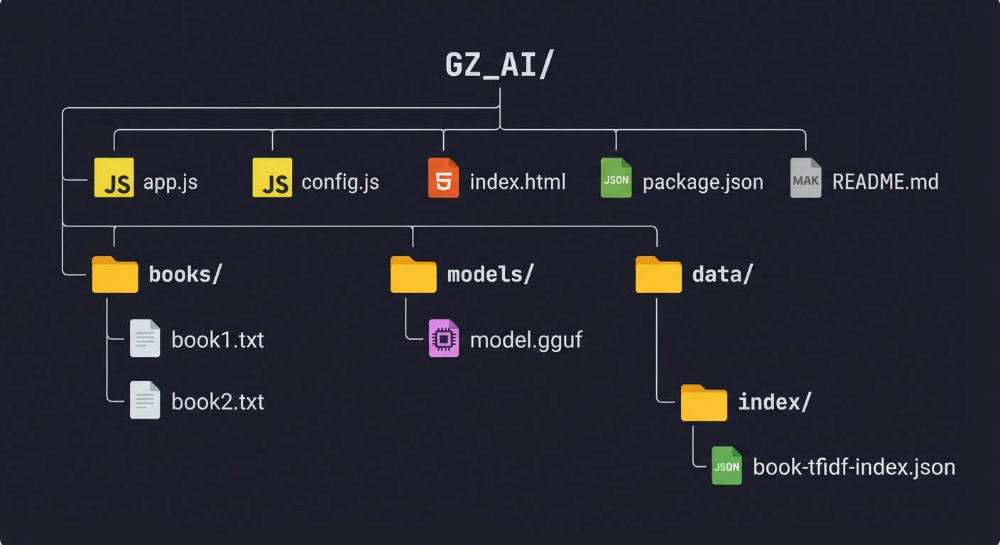
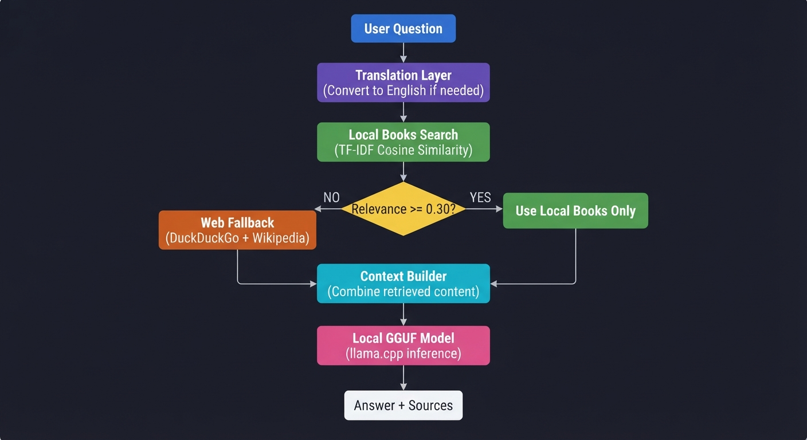

# GZ_AI

GZ_AI is a local retrieval-augmented generation (RAG) assistant built entirely with JavaScript and Node.js. It uses a local GGUF model through llama.cpp for inference and a lightweight TF-IDF index for local document retrieval. No Python is used anywhere in this project.

## Features

- Fully local AI inference using a GGUF model
- Local books and document retrieval using TF-IDF
- Web fallback through DuckDuckGo and Wikipedia
- Optional translation of user queries to English
- Source attribution in chat responses
- Lightweight and suitable for low-resource systems
- Single inference queue for stable performance
- Clean and responsive chat interface

## Requirements

### Minimum System Requirements

| Component | Minimum |
|-----------|---------|
| Operating System | Windows 10 64-bit |
| RAM | 8 GB |
| CPU | 4 cores with AVX2 support |
| GPU | Not required |
| Storage | 5 GB free disk space |
| Node.js | 18.0.0 or newer |
| npm | 9.0.0 or newer |

### Recommended System Requirements

| Component | Recommended |
|-----------|-------------|
| Operating System | Windows 11 64-bit |
| RAM | 16 GB or more |
| CPU | 8 cores or more |
| GPU | NVIDIA GPU with 8 GB VRAM |
| Storage | 20 GB or more on SSD |
| Node.js | 20 LTS or 22 LTS |
| npm | Latest stable version |

### Software Dependencies

- Node.js
- npm
- A GGUF language model
- llama.cpp runtime

## Installation

Follow these steps to install and run GZ_AI on your system.

### Step 1: Clone the Repository

```bash
git clone https://github.com/gz089/GZ_AI.git
cd GZ_AI
```

### Step 2: Install Dependencies

```bash
npm install
```

Expected output:

```
added 125 packages, and audited 126 packages in 15s

20 packages are looking for funding
  run `npm fund` for details

found 0 vulnerabilities
```

### Step 3: Create Required Directories

```bash
mkdir books
mkdir models
mkdir data
mkdir data/index
```

### Step 4: Download or Place Model

If you do not have a GGUF model, follow the Model Download Guide below. If you already have a model, place it in the `models` directory and rename it to `model.gguf`.

```bash
cp /path/to/your/existing-model.gguf models/model.gguf
```

### Step 5: Add Books

Place your text, markdown, or PDF files into the `books` directory.

```bash
cp /path/to/books/*.txt books/
```

### Step 6: Start the Server

```bash
npm start
```

Expected output:

```
> gz-ai@2.0.0 start
> node app.js

[GZ_AI] === GZ_AI Initialization ===
[GZ_AI] Node.js version: v20.11.0
[GZ_AI] Platform: win32 x64
[GZ_AI] Current directory: C:\Users\GZ_Developer\GZ_AI
[GZ_AI] Directory ready: books
[GZ_AI] Directory ready: data/index
[GZ_AI] Directory ready: models
[GZ_AI] Model file found: 93.07 MB
[GZ_AI] Loaded existing index with 88 chunks
[GZ_AI] === Initialization Complete ===
[GZ_AI] GZ_AI server running at http://127.0.0.1:3000
```

### Step 7: Open the Chat Interface

Open your browser and go to:

```
http://127.0.0.1:3000
```

## Model Download Guide

If you do not have a GGUF model, you can download one from the links below. Choose a model based on your system RAM and quality requirements.

### Model Selection Table

| Model Name | Parameters | File Size | RAM Required | Quality | Best For |
|------------|------------|-----------|--------------|---------|----------|
| TinyLlama 1.1B Chat | 1.1B | 636 MB | 2 GB | Basic | Testing, low RAM |
| Phi-2 | 2.7B | 1.6 GB | 4 GB | Good | CPU inference |
| Mistral 7B Instruct | 7B | 4.1 GB | 8 GB | Excellent | Balanced quality |
| Llama 3 8B Instruct | 8B | 4.7 GB | 8 GB | Very Good | General use |
| Llama 3.2 3B Instruct | 3B | 2.0 GB | 4 GB | Good | Multilingual |
| Qwen 2.5 7B Instruct | 7B | 4.7 GB | 8 GB | Excellent | Multilingual |

### Direct Download URLs

#### TinyLlama 1.1B Chat (Q4_K_M - 636 MB)

```bash
curl -L -o models/model.gguf "https://huggingface.co/TheBloke/TinyLlama-1.1B-Chat-v1.0-GGUF/resolve/main/tinyllama-1.1b-chat-v1.0.Q4_K_M.gguf"
```

#### Phi-2 (Q4_K_M - 1.6 GB)

```bash
curl -L -o models/model.gguf "https://huggingface.co/TheBloke/phi-2-GGUF/resolve/main/phi-2.Q4_K_M.gguf"
```

#### Mistral 7B Instruct (Q4_K_M - 4.1 GB)

```bash
curl -L -o models/model.gguf "https://huggingface.co/TheBloke/Mistral-7B-Instruct-v0.2-GGUF/resolve/main/mistral-7b-instruct-v0.2.Q4_K_M.gguf"
```

#### Llama 3 8B Instruct (Q4_K_M - 4.7 GB)

```bash
curl -L -o models/model.gguf "https://huggingface.co/TheBloke/Llama-3-8B-Instruct-GGUF/resolve/main/llama-3-8b-instruct.Q4_K_M.gguf"
```

#### Llama 3.2 3B Instruct (Q4_K_M - 2.0 GB)

```bash
curl -L -o models/model.gguf "https://huggingface.co/bartowski/Llama-3.2-3B-Instruct-GGUF/resolve/main/Llama-3.2-3B-Instruct-Q4_K_M.gguf"
```

#### Qwen 2.5 7B Instruct (Q4_K_M - 4.7 GB)

```bash
curl -L -o models/model.gguf "https://huggingface.co/bartowski/Qwen2.5-7B-Instruct-GGUF/resolve/main/Qwen2.5-7B-Instruct-Q4_K_M.gguf"
```

### Model Download Instructions

1. Select a model from the table above based on your RAM.
2. Copy the download command for that model.
3. Open a terminal in the GZ_AI directory.
4. Run the command. The model will download directly to the `models` folder.
5. Wait for the download to complete. Large files may take several minutes.
6. Start the server with `npm start`.

### Using Your Existing Model

If you already have a GGUF model file, place it in the `models` directory and rename it to `model.gguf`.

```bash
cp /path/to/your/existing-model.gguf models/model.gguf
```

### Recommended Models by RAM

| System RAM | Recommended Model | File Size |
|------------|-------------------|-----------|
| 4 GB | TinyLlama 1.1B | 636 MB |
| 8 GB | Phi-2 or Mistral 7B | 1.6 GB - 4.1 GB |
| 16 GB | Llama 3 8B or Qwen 7B | 4.7 GB |
| 32 GB | Llama 3 8B or larger | 4.7 GB+ |

## Development

To run the server in development mode with automatic restarts:

```bash
npm run dev
```

To check for outdated packages:

```bash
npm outdated
```

To update all packages:

```bash
npm update
```

## Project Structure

Below is the folder structure of the GZ_AI project:



## Configuration

All settings are located in `config.js`. You can adjust the following options:

| Setting | Description | Default |
|---------|-------------|---------|
| `modelPath` | Path to GGUF model | `./models/model.gguf` |
| `contextSize` | Context window size in tokens | `4096` |
| `maxTokens` | Maximum response length | `512` |
| `temperature` | Response creativity | `0.7` |
| `cpuThreads` | CPU threads for inference | `4` |
| `gpuLayers` | GPU layers to use | `0` |
| `topK` | Number of chunks to retrieve | `5` |
| `minLocalRelevance` | Threshold for local-only answers | `0.30` |
| `port` | Server port | `3000` |

## API Endpoints

### POST /api/chat

Request:

```json
{
  "message": "What is Python?"
}
```

Response:

```json
{
  "answer": "Python is a programming language...",
  "originalQuery": "What is Python?",
  "translatedQuery": "What is Python?",
  "sources": [
    {
      "type": "book",
      "name": "python-guide.txt",
      "score": 0.85
    }
  ]
}
```

### GET /api/status

Response:

```json
{
  "status": "online",
  "modelLoaded": true,
  "booksIndexed": 88
}
```

## How It Works

GZ_AI processes each user question through the following pipeline:



## Offline Behavior

GZ_AI works fully offline for local books and model inference. Translation, DuckDuckGo, and Wikipedia require internet access. If these services are unavailable, the assistant continues using local content and original query text.

## Security

All book and web content is treated as untrusted data. Retrieved content never overrides the system prompt. The frontend sanitizes displayed text and does not execute JavaScript from retrieved documents.

## Common Issues

### npm install fails

Clear the npm cache and try again:

```bash
npm cache clean --force
npm install
```

### Port already in use

Change the port in `config.js` to another value:

```javascript
port: 3001
```

### Model not loading

Check that the model file exists:

```bash
ls models/
```

The file should be named `model.gguf`.

## License

This project is licensed under the MIT License.

## Credits

- llama.cpp for GGUF inference
- Express for the web server
- HuggingFace for model hosting
```

---

Copy this entire block and save it as `README.md` in your GZ_AI folder. This is the complete, ready-to-upload file for GitHub.
