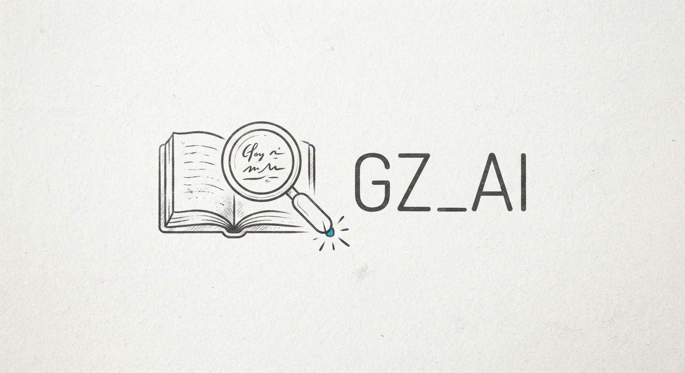
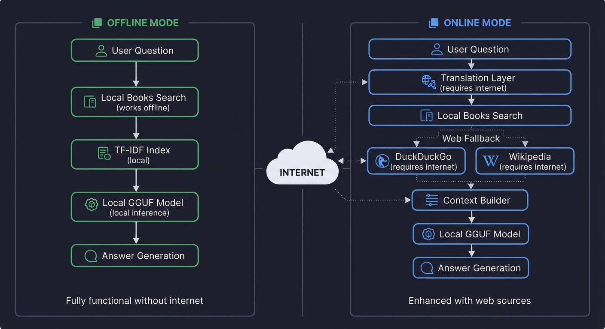
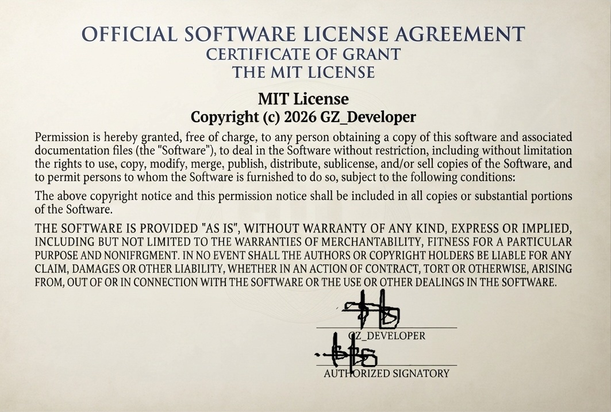

# GZ_Developer | AI/ML Engineer & Software Developer

[](https://gz-developer.netlify.app/)
[](https://github.com/gz089)
[](https://www.linkedin.com/in/gul-zaman-39319025b/)
[](https://web.facebook.com/profile.php?id=100089764673886)
[](https://wa.me/923123456789)

<div align="center">
    
    <h1>GZ_AI</h1>
    <p>Local AI Assistant</p>
</div>

GZ_AI is a local retrieval-augmented generation (RAG) assistant built entirely with JavaScript and Node.js. It uses a local GGUF model through llama.cpp for inference and a lightweight TF-IDF index for local document retrieval. No Python is used anywhere in this project.

## Features

- Fully local AI inference using a GGUF model
- Local books and document retrieval using TF-IDF
- Web fallback through DuckDuckGo and Wikipedia
- Optional translation of user queries to English
- Source attribution in chat responses
- Lightweight and suitable for low-resource systems
- Single inference queue for stable performance
- Clean and responsive chat interface

## Requirements

### Minimum System Requirements

| Component | Minimum |
|-----------|---------|
| Operating System | Windows 10 64-bit |
| RAM | 8 GB |
| CPU | 4 cores with AVX2 support |
| GPU | Not required |
| Storage | 5 GB free disk space |
| Node.js | 18.0.0 or newer |
| npm | 9.0.0 or newer |

### Recommended System Requirements

| Component | Recommended |
|-----------|-------------|
| Operating System | Windows 11 64-bit |
| RAM | 16 GB or more |
| CPU | 8 cores or more |
| GPU | NVIDIA GPU with 8 GB VRAM |
| Storage | 20 GB or more on SSD |
| Node.js | 20 LTS or 22 LTS |
| npm | Latest stable version |

### Software Dependencies

- Node.js
- npm
- A GGUF language model
- llama.cpp runtime

## Installation

Follow these steps to install and run GZ_AI on your system.

### Step 1: Clone the Repository

```bash
git clone https://github.com/gz089/GZ_AI.git
cd GZ_AI
```

### Step 2: Install Dependencies

```bash
npm install
```

Expected output:

```
added 125 packages, and audited 126 packages in 15s

20 packages are looking for funding
  run `npm fund` for details

found 0 vulnerabilities
```

### Step 3: Create Required Directories

```bash
mkdir books
mkdir models
mkdir data
mkdir data/index
```

### Step 4: Download or Place Model

If you do not have a GGUF model, follow the Model Download Guide below. If you already have a model, place it in the `models` directory and rename it to `model.gguf`.

```bash
cp /path/to/your/existing-model.gguf models/model.gguf
```

### Step 5: Add Books

Place your text, markdown, or PDF files into the `books` directory.

```bash
cp /path/to/books/*.txt books/
```

### Step 6: Start the Server

```bash
npm start
```

Expected output:

```
> gz-ai@2.0.0 start
> node app.js

[GZ_AI] === GZ_AI Initialization ===
[GZ_AI] Node.js version: v20.11.0
[GZ_AI] Platform: win32 x64
[GZ_AI] Current directory: C:\Users\GZ_Developer\GZ_AI
[GZ_AI] Directory ready: books
[GZ_AI] Directory ready: data/index
[GZ_AI] Directory ready: models
[GZ_AI] Model file found: 4.07 GB
[GZ_AI] Loaded existing index with 88 chunks
[GZ_AI] === Initialization Complete ===
[GZ_AI] GZ_AI server running at http://127.0.0.1:3000
```

### Step 7: Open the Chat Interface

Open your browser and go to:

```
http://127.0.0.1:3000
```

## Model Download Guide

If you do not have a GGUF model, you can download one from the links below. Choose a model based on your system RAM and quality requirements.

### Model Selection Table 

| Model Name | Parameters | File Size (Q4_K_M) | RAM Required | Quality | Best For |
|------------|------------|--------------------|--------------|---------|----------|
| TinyLlama 1.1B Chat | 1.1B | 636 MB | 2 GB | Basic | Testing, low RAM |
| Llama 3.2 1B Instruct | 1B | 600 MB | 2 GB | Good | Edge devices |
| Gemma 2 2B | 2B | 1.4 GB | 4 GB | Good | Compact use |
| Phi-2 | 2.7B | 1.6 GB | 4 GB | Good | CPU inference |
| Llama 3.2 3B Instruct | 3B | 2.0 GB | 4 GB | Good | Multilingual |
| Qwen 2.5 3B Instruct | 3B | 2.0 GB | 4 GB | Good | Multilingual |
| Phi-3 Mini | 3.8B | 2.2 GB | 4 GB | Good | Strong small model |
| Phi-3.5 Mini | 3.8B | 2.3 GB | 4 GB | Good | Improved reasoning |
| GPT-J 6B | 6B | 3.6 GB | 8 GB | Moderate | Older open model |
| MPT 7B | 7B | 4.1 GB | 8 GB | Good | Chat |
| Mistral 7B Instruct | 7B | 4.1 GB | 8 GB | Excellent | Balanced quality |
| Mistral 7B v0.3 | 7B | 4.1 GB | 8 GB | Excellent | Latest Mistral |
| Zephyr 7B | 7B | 4.1 GB | 8 GB | Excellent | Chat fine-tuned |
| OpenChat 3.5 7B | 7B | 4.1 GB | 8 GB | Excellent | Conversation |
| Neural Chat 7B | 7B | 4.1 GB | 8 GB | Excellent | Instruction tuned |
| WizardLM 7B | 7B | 4.1 GB | 8 GB | Excellent | Instruction tuned |
| Vicuna 7B | 7B | 4.1 GB | 8 GB | Good | Classic chat |
| CodeLlama 7B | 7B | 4.1 GB | 8 GB | Good | Code generation |
| Llama 2 7B | 7B | 3.8 GB | 8 GB | Good | Older reliable |
| OPT 6.7B | 6.7B | 4.0 GB | 8 GB | Moderate | Research |
| Llama 3 8B Instruct | 8B | 4.7 GB | 8 GB | Very Good | General use |
| Llama 3.1 8B | 8B | 4.7 GB | 8 GB | Very Good | Updated Llama 3 |
| Qwen 2.5 7B Instruct | 7B | 4.4 GB | 8 GB | Excellent | Multilingual |
| Gemma 7B | 7B | 4.5 GB | 8 GB | Excellent | Google's 7B |
| DeepSeek Coder 6.7B | 6.7B | 4.0 GB | 8 GB | Good | Code specialized |
| StarCoder 7B | 7B | 4.1 GB | 8 GB | Good | Code generation |
| Falcon 7B | 7B | 4.1 GB | 8 GB | Good | General use |
| StableLM 7B | 7B | 4.1 GB | 8 GB | Good | General use |
| Mistral Nemo 12B | 12B | 7.0 GB | 12 GB | Very Good | Mid-size |
| Llama 3.2 11B | 11B | 6.5 GB | 12 GB | Very Good | Vision-language |
| Qwen 2.5 14B | 14B | 8.5 GB | 16 GB | Excellent | Multilingual |
| CodeLlama 13B | 13B | 7.8 GB | 16 GB | Very Good | Large code model |
| Llama 2 13B | 13B | 7.4 GB | 16 GB | Very Good | Older 13B |
| Phi-3 Medium | 14B | 8.5 GB | 16 GB | Excellent | Phi-3 larger |
| Gemma 2 9B | 9B | 5.5 GB | 12 GB | Very Good | Efficient 9B |
| StarCoder2 15B | 15B | 9.0 GB | 16 GB | Very Good | Code focused |
| Command R 35B | 35B | 21 GB | 32 GB | Excellent | Cohere model |
| Qwen 2.5 32B | 32B | 19.5 GB | 32 GB | Excellent | Very strong |
| Gemma 2 27B | 27B | 16.5 GB | 32 GB | Excellent | Google's large |
| CodeLlama 34B | 34B | 19 GB | 32 GB | Excellent | Large code |
| Mixtral 8x7B | 46B total (12B active) | 24.5 GB | 32 GB | Excellent | MoE high quality |
| Llama 3 70B | 70B | 40 GB | 64 GB | Excellent | High quality |
| Llama 3.1 70B | 70B | 40 GB | 64 GB | Excellent | Updated large |
| Llama 2 70B | 70B | 38 GB | 64 GB | Excellent | Older 70B |
| Qwen 2.5 72B | 72B | 43 GB | 64 GB | Excellent | Multilingual large |
| Falcon 40B | 40B | 24 GB | 40 GB | Excellent | TII large |
| DBRX 132B | 132B total (36B active) | 75 GB | 128 GB | Excellent | Databricks MoE |
| Mixtral 8x22B | 141B total (39B active) | 80 GB | 128 GB | Excellent | Very large MoE |
| Pythia 12B | 12B | 7.2 GB | 12 GB | Moderate | Research |
| OPT 13B | 13B | 7.8 GB | 16 GB | Moderate | Research |
| BLOOM 7B | 7B | 4.1 GB | 8 GB | Moderate | Multilingual |
| BLOOMZ 7B | 7B | 4.1 GB | 8 GB | Moderate | Instruction tuned |
| Baichuan 7B | 7B | 4.1 GB | 8 GB | Good | Chinese/English |
| Baichuan 13B | 13B | 7.8 GB | 16 GB | Very Good | Chinese/English |
| ChatGLM 6B | 6B | 3.6 GB | 8 GB | Good | Chinese/English |
| ChatGLM2 6B | 6B | 3.6 GB | 8 GB | Good | Chinese/English |
| XVERSE 7B | 7B | 4.1 GB | 8 GB | Good | Multilingual |
| XVERSE 13B | 13B | 7.8 GB | 16 GB | Very Good | Multilingual |
| Yi 6B | 6B | 3.6 GB | 8 GB | Good | Multilingual |
| Yi 34B | 34B | 19 GB | 32 GB | Excellent | Multilingual |
| Aquila 7B | 7B | 4.1 GB | 8 GB | Good | Multilingual |
| Aquila2 7B | 7B | 4.1 GB | 8 GB | Good | Multilingual |
| InternLM 7B | 7B | 4.1 GB | 8 GB | Good | Multilingual |
| InternLM 20B | 20B | 12 GB | 20 GB | Excellent | Multilingual |
| DeepSeek LLM 7B | 7B | 4.1 GB | 8 GB | Good | General use |
| DeepSeek LLM 67B | 67B | 38 GB | 64 GB | Excellent | Large general |
| Skywork 13B | 13B | 7.8 GB | 16 GB | Very Good | General use |
| TigerBot 7B | 7B | 4.1 GB | 8 GB | Good | Multilingual |
| TigerBot 13B | 13B | 7.8 GB | 16 GB | Very Good | Multilingual |
| LLaMA Pro 8B | 8B | 4.7 GB | 8 GB | Very Good | General use |
| Vicuna 13B | 13B | 7.8 GB | 16 GB | Very Good | Chat |
| WizardCoder 15B | 15B | 9.0 GB | 16 GB | Very Good | Code specialized |
| CodeQwen 7B | 7B | 4.1 GB | 8 GB | Good | Code specialized |
| CodeQwen 14B | 14B | 8.5 GB | 16 GB | Very Good | Code specialized |
| StableLM 12B | 12B | 7.2 GB | 12 GB | Good | General use |
| Megatron 11B | 11B | 6.5 GB | 12 GB | Good | General use |
| OpenLLaMA 7B | 7B | 4.1 GB | 8 GB | Good | Open license |
| RedPajama 7B | 7B | 4.1 GB | 8 GB | Good | Open license |
| RedPajama 13B | 13B | 7.8 GB | 16 GB | Very Good | Open license |
| MiniChat 7B | 7B | 4.1 GB | 8 GB | Good | Chat |
| Dolphin 7B | 7B | 4.1 GB | 8 GB | Good | Uncensored chat |
| Dolphin 13B | 13B | 7.8 GB | 16 GB | Very Good | Uncensored chat |
| OpenBuddy 7B | 7B | 4.1 GB | 8 GB | Good | Multilingual chat |
| OpenBuddy 13B | 13B | 7.8 GB | 16 GB | Very Good | Multilingual chat |

*Note: File sizes are approximate for Q4_K_M quantization. RAM Required includes overhead for context and system processes. For GPU offloading, lower system RAM may be acceptable depending on GPU VRAM.*


### Direct Download URLs

#### TinyLlama 1.1B Chat (Q4_K_M - 636 MB)

```bash
curl -L -o models/model.gguf "https://huggingface.co/TheBloke/TinyLlama-1.1B-Chat-v1.0-GGUF/resolve/main/tinyllama-1.1b-chat-v1.0.Q4_K_M.gguf"
```

#### Phi-2 (Q4_K_M - 1.6 GB)

```bash
curl -L -o models/model.gguf "https://huggingface.co/TheBloke/phi-2-GGUF/resolve/main/phi-2.Q4_K_M.gguf"
```

#### Phi-3 Mini (Q4_K_M - 2.2 GB)

```bash
curl -L -o models/model.gguf "https://huggingface.co/bartowski/Phi-3.1-mini-4k-instruct-GGUF/resolve/main/Phi-3.1-mini-4k-instruct-Q4_K_M.gguf"
```

#### Llama 3.2 1B Instruct (Q4_K_M - 600 MB)

```bash
curl -L -o models/model.gguf "https://huggingface.co/bartowski/Llama-3.2-1B-Instruct-GGUF/resolve/main/Llama-3.2-1B-Instruct-Q4_K_M.gguf"
```

#### Llama 3.2 3B Instruct (Q4_K_M - 2.0 GB)

```bash
curl -L -o models/model.gguf "https://huggingface.co/bartowski/Llama-3.2-3B-Instruct-GGUF/resolve/main/Llama-3.2-3B-Instruct-Q4_K_M.gguf"
```

#### Gemma 2 2B (Q4_K_M - 1.4 GB)

```bash
curl -L -o models/model.gguf "https://huggingface.co/bartowski/gemma-2-2b-it-GGUF/resolve/main/gemma-2-2b-it-Q4_K_M.gguf"
```

#### Qwen 2.5 3B Instruct (Q4_K_M - 2.0 GB)

```bash
curl -L -o models/model.gguf "https://huggingface.co/bartowski/Qwen2.5-3B-Instruct-GGUF/resolve/main/Qwen2.5-3B-Instruct-Q4_K_M.gguf"
```

#### Mistral 7B Instruct v0.2 (Q4_K_M - 4.1 GB)

```bash
curl -L -o models/model.gguf "https://huggingface.co/TheBloke/Mistral-7B-Instruct-v0.2-GGUF/resolve/main/mistral-7b-instruct-v0.2.Q4_K_M.gguf"
```

#### Mistral 7B Instruct v0.3 (Q4_K_M - 4.1 GB)

```bash
curl -L -o models/model.gguf "https://huggingface.co/bartowski/Mistral-7B-Instruct-v0.3-GGUF/resolve/main/Mistral-7B-Instruct-v0.3-Q4_K_M.gguf"
```

#### Zephyr 7B Beta (Q4_K_M - 4.1 GB)

```bash
curl -L -o models/model.gguf "https://huggingface.co/TheBloke/zephyr-7B-beta-GGUF/resolve/main/zephyr-7b-beta.Q4_K_M.gguf"
```

#### OpenChat 3.5 7B (Q4_K_M - 4.1 GB)

```bash
curl -L -o models/model.gguf "https://huggingface.co/TheBloke/openchat_3.5-GGUF/resolve/main/openchat_3.5.Q4_K_M.gguf"
```

#### Llama 3 8B Instruct (Q4_K_M - 4.7 GB)

```bash
curl -L -o models/model.gguf "https://huggingface.co/TheBloke/Llama-3-8B-Instruct-GGUF/resolve/main/llama-3-8b-instruct.Q4_K_M.gguf"
```

#### Llama 3.1 8B Instruct (Q4_K_M - 4.7 GB)

```bash
curl -L -o models/model.gguf "https://huggingface.co/bartowski/Llama-3.1-8B-Instruct-GGUF/resolve/main/Llama-3.1-8B-Instruct-Q4_K_M.gguf"
```

#### Qwen 2.5 7B Instruct (Q4_K_M - 4.7 GB)

```bash
curl -L -o models/model.gguf "https://huggingface.co/bartowski/Qwen2.5-7B-Instruct-GGUF/resolve/main/Qwen2.5-7B-Instruct-Q4_K_M.gguf"
```

#### Gemma 7B Instruct (Q4_K_M - 4.5 GB)

```bash
curl -L -o models/model.gguf "https://huggingface.co/bartowski/gemma-7b-it-GGUF/resolve/main/gemma-7b-it-Q4_K_M.gguf"
```

#### CodeLlama 7B Instruct (Q4_K_M - 4.1 GB)

```bash
curl -L -o models/model.gguf "https://huggingface.co/TheBloke/CodeLlama-7B-Instruct-GGUF/resolve/main/codellama-7b-instruct.Q4_K_M.gguf"
```

#### DeepSeek Coder 6.7B (Q4_K_M - 4.0 GB)

```bash
curl -L -o models/model.gguf "https://huggingface.co/TheBloke/deepseek-coder-6.7B-instruct-GGUF/resolve/main/deepseek-coder-6.7b-instruct.Q4_K_M.gguf"
```

#### Mistral Nemo 12B (Q4_K_M - 7.0 GB)

```bash
curl -L -o models/model.gguf "https://huggingface.co/bartowski/Mistral-Nemo-Instruct-2407-GGUF/resolve/main/Mistral-Nemo-Instruct-2407-Q4_K_M.gguf"
```

#### Llama 3.2 11B Vision Instruct (Q4_K_M - 6.5 GB)

```bash
curl -L -o models/model.gguf "https://huggingface.co/bartowski/Llama-3.2-11B-Vision-Instruct-GGUF/resolve/main/Llama-3.2-11B-Vision-Instruct-Q4_K_M.gguf"
```

#### Qwen 2.5 14B Instruct (Q4_K_M - 8.5 GB)

```bash
curl -L -o models/model.gguf "https://huggingface.co/bartowski/Qwen2.5-14B-Instruct-GGUF/resolve/main/Qwen2.5-14B-Instruct-Q4_K_M.gguf"
```

#### Gemma 2 9B Instruct (Q4_K_M - 5.5 GB)

```bash
curl -L -o models/model.gguf "https://huggingface.co/bartowski/gemma-2-9b-it-GGUF/resolve/main/gemma-2-9b-it-Q4_K_M.gguf"
```

#### Qwen 2.5 32B Instruct (Q4_K_M - 19.5 GB)

```bash
curl -L -o models/model.gguf "https://huggingface.co/bartowski/Qwen2.5-32B-Instruct-GGUF/resolve/main/Qwen2.5-32B-Instruct-Q4_K_M.gguf"
```

#### Gemma 2 27B Instruct (Q4_K_M - 16.5 GB)

```bash
curl -L -o models/model.gguf "https://huggingface.co/bartowski/gemma-2-27b-it-GGUF/resolve/main/gemma-2-27b-it-Q4_K_M.gguf"
```

#### Mixtral 8x7B Instruct (Q4_K_M - 24.5 GB)

```bash
curl -L -o models/model.gguf "https://huggingface.co/TheBloke/Mixtral-8x7B-Instruct-v0.1-GGUF/resolve/main/mixtral-8x7b-instruct-v0.1.Q4_K_M.gguf"
```

#### Llama 3 70B Instruct (Q4_K_M - 40 GB)

```bash
curl -L -o models/model.gguf "https://huggingface.co/TheBloke/Llama-3-70B-Instruct-GGUF/resolve/main/llama-3-70b-instruct.Q4_K_M.gguf"
```

#### Qwen 2.5 72B Instruct (Q4_K_M - 43 GB)

```bash
curl -L -o models/model.gguf "https://huggingface.co/bartowski/Qwen2.5-72B-Instruct-GGUF/resolve/main/Qwen2.5-72B-Instruct-Q4_K_M.gguf"
```

*Note: Replace the model URL with the correct one for your chosen quantization. The URLs above point to Q4_K_M quantizations which offer a good balance of quality and size.*


### Model Download Instructions

1. Select a model from the table above based on your RAM.
2. Copy the download command for that model.
3. Open a terminal in the GZ_AI directory.
4. Run the command. The model will download directly to the `models` folder.
5. Wait for the download to complete. Large files may take several minutes.
6. Start the server with `npm start`.

### Using Your Existing Model

If you already have a GGUF model file, place it in the `models` directory and rename it to `model.gguf`.

```bash
cp /path/to/your/existing-model.gguf models/model.gguf
```

## Model Catalog 

Below is a comprehensive list of GGUF models suitable for different RAM capacities. All sizes are approximate for Q4_K_M quantization. RAM Required indicates the minimum system RAM needed to run the model comfortably.

| Model Name | Parameters | File Size (Q4_K_M) | RAM Required | Notes |
|------------|------------|--------------------|--------------|-------|
| TinyLlama 1.1B Chat | 1.1B | 636 MB | 2 GB | Basic testing, very low RAM |
| Phi-2 | 2.7B | 1.6 GB | 4 GB | Good for CPU inference |
| Phi-3 Mini | 3.8B | 2.2 GB | 4 GB | Strong small model |
| Phi-3.5 Mini | 3.8B | 2.3 GB | 4 GB | Improved reasoning |
| Llama 3.2 1B | 1B | 600 MB | 2 GB | Multilingual, very light |
| Llama 3.2 3B | 3B | 1.9 GB | 4 GB | Good for edge devices |
| Qwen 2.5 3B | 3B | 2.0 GB | 4 GB | Excellent multilingual |
| Gemma 2 2B | 2B | 1.4 GB | 4 GB | Google's small model |
| Mistral 7B Instruct | 7B | 4.1 GB | 8 GB | Balanced quality |
| Mistral 7B v0.3 | 7B | 4.1 GB | 8 GB | Latest Mistral |
| Zephyr 7B | 7B | 4.1 GB | 8 GB | Fine-tuned for chat |
| OpenChat 3.5 7B | 7B | 4.1 GB | 8 GB | Strong open chat |
| Neural Chat 7B | 7B | 4.1 GB | 8 GB | Good for conversation |
| WizardLM 7B | 7B | 4.1 GB | 8 GB | Instruction tuned |
| Vicuna 7B | 7B | 4.1 GB | 8 GB | Classic chat model |
| CodeLlama 7B | 7B | 4.1 GB | 8 GB | Code generation |
| Llama 2 7B | 7B | 3.8 GB | 8 GB | Older but reliable |
| Llama 3 8B Instruct | 8B | 4.7 GB | 8 GB | Very good general use |
| Llama 3.1 8B | 8B | 4.7 GB | 8 GB | Updated Llama 3 |
| Qwen 2.5 7B | 7B | 4.4 GB | 8 GB | Excellent multilingual |
| Gemma 7B | 7B | 4.5 GB | 8 GB | Google's 7B model |
| DeepSeek Coder 6.7B | 6.7B | 4.0 GB | 8 GB | Specialized for code |
| Mistral Nemo 12B | 12B | 7.0 GB | 12 GB | Mid-size, good quality |
| Llama 3.2 11B | 11B | 6.5 GB | 12 GB | Vision-language capable |
| Qwen 2.5 14B | 14B | 8.5 GB | 16 GB | Strong multilingual |
| CodeLlama 13B | 13B | 7.8 GB | 16 GB | Larger code model |
| Llama 2 13B | 13B | 7.4 GB | 16 GB | Older 13B |
| Phi-3 Medium | 14B | 8.5 GB | 16 GB | Phi-3 larger variant |
| Gemma 2 9B | 9B | 5.5 GB | 12 GB | Efficient 9B |
| StarCoder2 15B | 15B | 9.0 GB | 16 GB | Code focused |
| Mixtral 8x7B | 46B total (12B active) | 24.5 GB | 32 GB | MoE, high quality |
| Qwen 2.5 32B | 32B | 19.5 GB | 32 GB | Very strong |
| Gemma 2 27B | 27B | 16.5 GB | 32 GB | Google's large model |
| Llama 3 70B | 70B | 40 GB | 64 GB | Very high quality |
| Llama 3.1 70B | 70B | 40 GB | 64 GB | Updated large model |
| Llama 2 70B | 70B | 38 GB | 64 GB | Older 70B |
| CodeLlama 34B | 34B | 19 GB | 32 GB | Large code model |
| Qwen 2.5 72B | 72B | 43 GB | 64 GB | Excellent multilingual |
| Mixtral 8x22B | 141B total (39B active) | 80 GB | 128 GB | Very large MoE |
| Command R 35B | 35B | 21 GB | 32 GB | Cohere's model |
| Falcon 40B | 40B | 24 GB | 40 GB | TII's large model |
| DBRX 132B | 132B total (36B active) | 75 GB | 128 GB | Databricks MoE |
| GPT-J 6B | 6B | 3.6 GB | 8 GB | Older open model |
| MPT 7B | 7B | 4.1 GB | 8 GB | Mosaic's model |
| Pythia 12B | 12B | 7.2 GB | 12 GB | Research model |
| OPT 6.7B | 6.7B | 4.0 GB | 8 GB | Meta's OPT |

*Note: File sizes are approximate for Q4_K_M quantization. RAM required includes overhead for context and system. For GPU offloading, lower system RAM may be acceptable if using GPU layers.*
## Development

To run the server in development mode with automatic restarts:

```bash
npm run dev
```

To check for outdated packages:

```bash
npm outdated
```

To update all packages:

```bash
npm update
```

## Project Structure

Below is the folder structure of the GZ_AI project:


## Configuration

All settings are located in `config.js`. You can adjust the following options:

| Setting | Description | Default |
|---------|-------------|---------|
| `modelPath` | Path to GGUF model | `./models/model.gguf` |
| `contextSize` | Context window size in tokens | `4096` |
| `maxTokens` | Maximum response length | `512` |
| `temperature` | Response creativity | `0.7` |
| `cpuThreads` | CPU threads for inference | `4` |
| `gpuLayers` | GPU layers to use | `0` |
| `topK` | Number of chunks to retrieve | `5` |
| `minLocalRelevance` | Threshold for local-only answers | `0.30` |
| `port` | Server port | `3000` |

## API Endpoints

### POST /api/chat

Request:

```json
{
  "message": "What is Python?"
}
```

Response:

```json
{
  "answer": "Python is a programming language...",
  "originalQuery": "What is Python?",
  "translatedQuery": "What is Python?",
  "sources": [
    {
      "type": "book",
      "name": "python-guide.txt",
      "score": 0.85
    }
  ]
}
```

### GET /api/status

Response:

```json
{
  "status": "online",
  "modelLoaded": true,
  "booksIndexed": 88
}
```

## How It Works

GZ_AI processes each user question through the following pipeline:


## Offline Behavior



## Security

All book and web content is treated as untrusted data. Retrieved content never overrides the system prompt. The frontend sanitizes displayed text and does not execute JavaScript from retrieved documents.

## Common Issues

### npm install fails

Clear the npm cache and try again:

```bash
npm cache clean --force
npm install
```

### Port already in use

Change the port in `config.js` to another value:

```javascript
port: 3001
```

### Model not loading

Check that the model file exists:

```bash
ls models/
```

The file should be named `model.gguf`.

## License

This project is licensed under the MIT License.



## Credits

- llama.cpp for GGUF inference
- Express for the web server
- HuggingFace for model providing
- GZ_Developer for providing documentation guide to run
```
